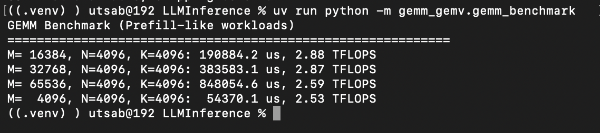

# LLM Inference

### Run the test
```
uv run pytest 

uv run pytest attention/test.py -v
uv run pytest kv_cache/test.py -v 
```

### Run the benchmark
```
uv run python -m attention.benchmark
uv run python -m kv_cache.benchmark
```

### MPS vs CPU comparision in Apple M4 air

<h3>Attention</h3>


<h3>KV Cache</h3>

<table align="center">
  <tr>
    <td align="center">
      <b>With MPS Float32</b><br/>
      
    </td>
    <td align="center">
      <b>With MPS Float16</b><br/>
      
    </td>
  </tr>
</table>

<h3>GEMM_GEMV</h3>

GEMM in MPS (fp16) 
