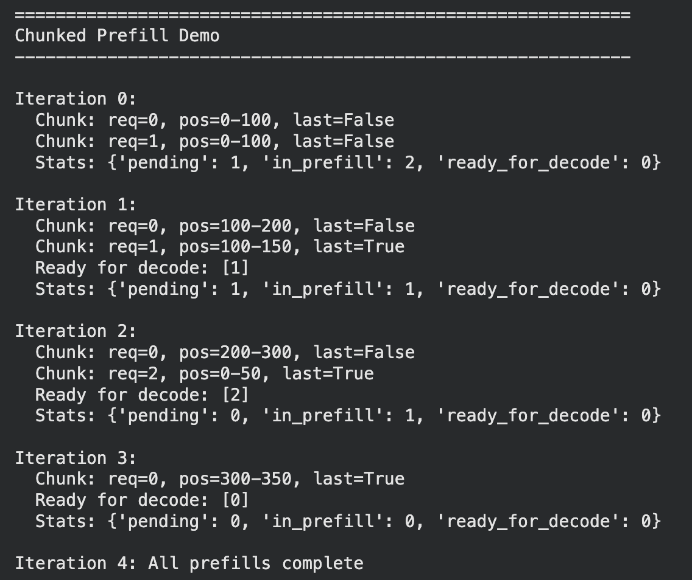
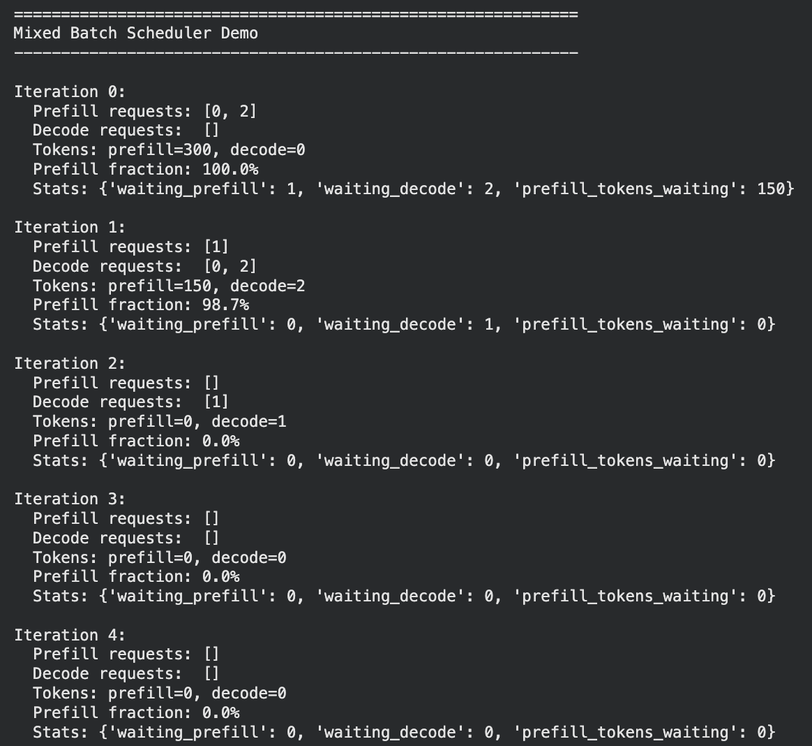
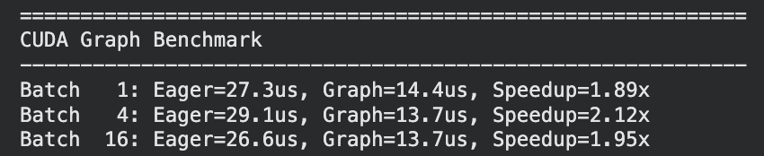
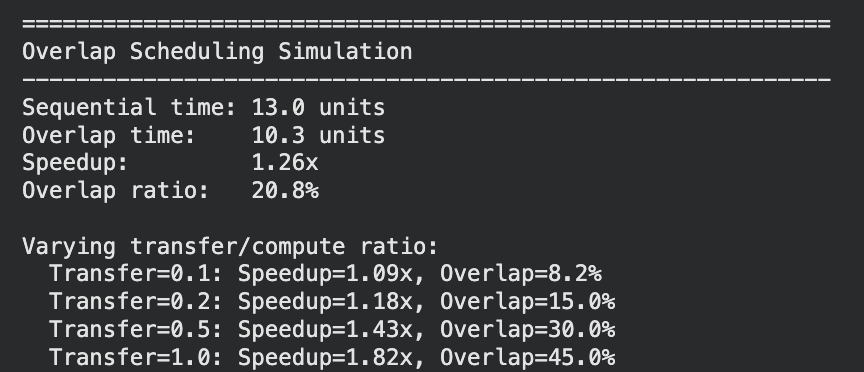

# Outputs

### Prefilled Chunk
Instead of waiting for single large prefill to process, we divide into chunks so that other get chances too and one with less prefill tokens gets chance to finish.

### Mixed Batch
Not only prefill, introducing decode process of finished chunk in single go makes it better.

### Cuda Graph
Reduce waiting game by capturing the graph for suitable batches.

### Overlap scheduling
Remove the waiting game between processes by parallel processing batching, scheduling and (prefill, decode).

